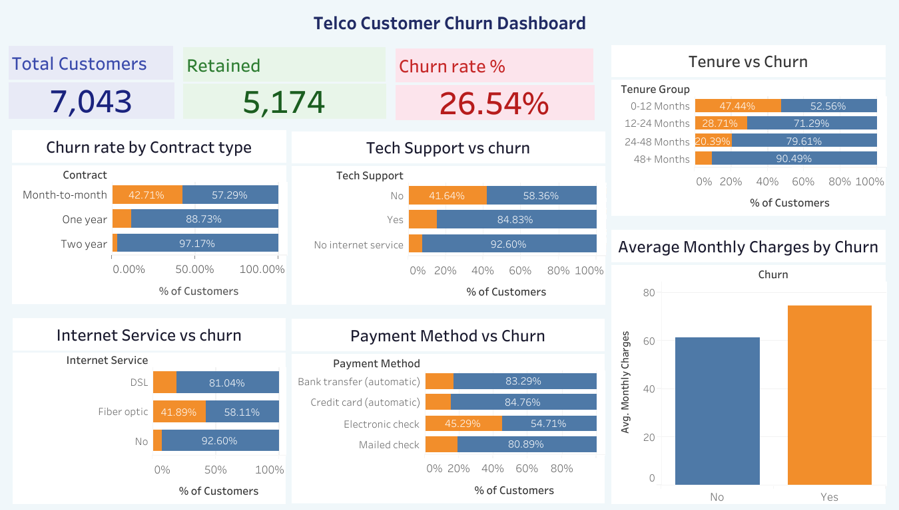

# Telco Customer Churn Analysis | End-to-End Data Analytics Project

## Project Summary

An end-to-end analysis of customer churn for a telecom company: data cleaning in Python, structured validation and business analysis in MySQL, and an interactive Tableau Public dashboard to surface actionable retention insights.

**Data source:** [IBM Telco Customer Churn dataset](https://www.kaggle.com/datasets/blastchar/telco-customer-churn) — 7,043 customers, 21 features.

---

## Business Objective

Identify the key drivers of customer churn and provide data-backed recommendations to reduce churn rate and improve retention.

---

## Tech Stack

* **Python (Pandas)** – Data cleaning & preparation
* **MySQL** – Data validation & analytical queries
* **Tableau Public** – Interactive dashboard visualization
* **Jupyter Notebook**

---

## Project Workflow

### 1. Data Cleaning & Preparation (Python)

* Cleaned `TotalCharges`: 11 rows had a blank value instead of a number — all are new customers with `tenure = 0` who haven't been billed yet, so these were filled with 0 rather than dropped
* Verified 0 duplicate rows and 0 duplicate `customerID`s
* Validated `tenure` and `MonthlyCharges` fall within plausible ranges before proceeding
* Exported the cleaned dataset (`telco_churn_cleaned.csv`) — the shared source for both SQL and Tableau

### 2. SQL Data Validation & Analysis

Loaded `telco_churn_cleaned.csv` into MySQL via the Table Data Import Wizard, ran validation checks (row count, duplicate ID check), then queried:

* Total customers & overall churn rate
* Churn rate by contract type
* Churn rate by payment method
* Churn rate by internet service type
* Churn rate by tenure group (0-12 / 12-24 / 24-48 / 48+ months)
* Churn rate by tech support availability
* Average monthly charges by churn
* Average tenure by churn

All metrics were validated in SQL before being reproduced in the dashboard, so every dashboard number traces back to a query with the same result.

### 3. Interactive Dashboard (Tableau)

* **3 KPI cards:** Total Customers, Retained, Churn Rate %
* **6 analytical visualizations:** stacked bar charts (Contract, Tenure Group, Tech Support, Internet Service, Payment Method) and a comparative bar chart (Average Monthly Charges by Churn)
* Business-focused layout for executive-level review

🔗 **Live Dashboard:**
https://public.tableau.com/views/Dashboard_17771682761600/Dashboard1?:language=en-GB&:sid=&:redirect=auth&:display_count=n&:origin=viz_share_link

---

## Key Analytical Insights

* Overall churn rate: **26.54%** (1,869 of 7,043 customers)
* **Contract type** is the strongest churn predictor: month-to-month customers churn at **42.71%**, vs. 11.27% for one-year and 2.83% for two-year contracts
* **Tenure** matters just as much: churn is **47.44%** in the first 12 months, dropping to 9.51% past 48 months — early-stage retention is the highest-leverage window
* **Tech support** shows one of the largest swings of any single feature: **41.64%** churn with no tech support vs. **15.17%** with it
* **Fiber optic** customers churn at 41.89%, more than double DSL (18.96%)
* **Electronic check** users churn at **45.29%** — by far the highest of any payment method; both automatic payment methods churn under 17%
* Churned customers pay more on average ($74.44/month) than retained customers ($61.27/month)

---

## Business Recommendations

* **Incentivize migration off month-to-month contracts** — the single largest churn gap in the data (42.71% vs. 2.83% for two-year customers)
* **Prioritize the first 12 months of the customer lifecycle** — nearly half of new customers churn in this window; proactive onboarding has more leverage here than anywhere else
* **Bundle or promote tech support with fiber optic plans** — both are independently associated with higher churn, and tech support already shows a strong retention effect on its own
* **Encourage migration to automatic payment methods** — electronic check users churn at nearly 3x the rate of automatic payment users
* **Investigate fiber optic pricing/service quality** specifically, given it churns more than double DSL despite presumably being the premium offering

---

## Project Structure

- `python/churn_cleaning_notebook.ipynb` — Python data cleaning, validation, and EDA
- `data/telco_churn_cleaned.csv` — Cleaned dataset shared by SQL and Tableau
- `sql/telco_churn_analysis.sql` — SQL validation & analytical queries
- `tableau/telco_churn_dashboard.twbx` — Tableau dashboard file (packaged with embedded data)
- `tableau/Dashboard_preview.png` — Dashboard screenshot

---

## How to Reproduce

1. Clone or download this repository
2. Open `python/churn_cleaning_notebook.ipynb` in Jupyter Notebook or Google Colab and run all cells top to bottom to regenerate `telco_churn_cleaned.csv`
3. In MySQL Workbench: run the setup portion of `sql/telco_churn_analysis.sql` (`CREATE DATABASE` → `CREATE TABLE`), then use the **Table Data Import Wizard** to load `telco_churn_cleaned.csv` into the `telco_churn` table
4. Run the validation and analysis queries in `sql/telco_churn_analysis.sql`
5. Open `tableau/telco_churn_dashboard.twbx` in Tableau Desktop — since it's a packaged workbook with the data embedded, it opens and displays correctly without needing the original CSV path. The CSV is only needed if you want to refresh the extract with new data. Or view the live dashboard using the link above.

---

## Skills Demonstrated

* Data cleaning & validation
* SQL aggregation & business query writing
* KPI design & dashboard structuring
* Data storytelling
* End-to-end analytics workflow execution

---

## Author

Himanshu
Aspiring Data Analyst | SQL | Python | Tableau
